# 🌟 Welcome to Noé Landré's Profile 🌟

<em>A passionate AI engineer and full-stack developer from France</em>

## ✨ About Me

- 🌱 I’m currently learning **C++ programming** to contribute to Ladybird browser

- 👀 I'm interested in **open-source**

## 🏆 GitHub Trophies

  

## 📊 GitHub Stats

  

## 🔝 Most Used Languages

  

## 💻 Tech Stack

### 🎨 Frontend

      

### ⚙️ Backend

     

### 🚀 DevOps

 

### 🧠 AI/ML

      

### 📱 Mobile

 

### 💬 Languages

    

## 🌐 Socials

  

## 📫 How to reach me

**Email:** noe.landre@sylfo.com

<!-- ⚠️ Important: Replace 'DevNono' with your actual GitHub username in the URLs below -->

🌈 <i>Let's connect and build amazing things together!</i> 🚀

